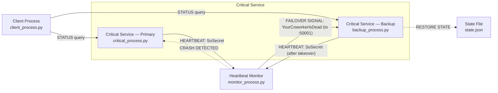

# Software Architecture Diagram

```mermaid
flowchart LR
    CLIENT["Client Process<br/>client_process.py"]

    subgraph CRIT["Critical Service"]
        CP["Critical Service — Primary<br/>critical_process.py"]
        CB["Critical Service — Backup<br/>backup_process.py"]
    end

    MON["Heartbeat Monitor<br/>monitor_process.py"]
    STATE["State File<br/>state.json"]

    CLIENT -- "STATUS query" --> CP
    CLIENT -- "STATUS query" --> CB
    CP -- "HEARTBEAT: SoSecret" --> MON
    MON -.->|CRASH DETECTED| CP
    MON -- "FAILOVER SIGNAL: YourCoworkerIsDead (to :50001)" --> CB
    CB -.->|RESTORE STATE| STATE
    CB -- "HEARTBEAT: SoSecret (after takeover)" --> MON
```
